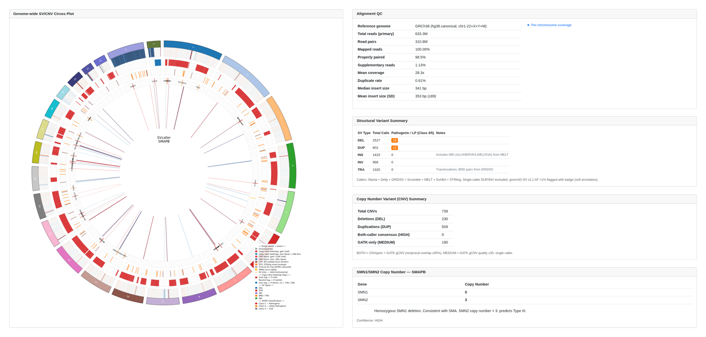

# SVcaller

[](https://www.nextflow.io/)
[](https://www.docker.com/)
[](https://www.python.org/)
[](#testing)
[](LICENSE)

**A production-ready Nextflow DSL2 pipeline for calling structural variants (SVs), copy number variants (CNVs), and SMN1/SMN2 copy numbers from Illumina paired-end WGS data (PE150, ≥30×).**

Accepts FASTQ or pre-aligned BAM input. Produces a per-sample HTML report with an embedded Circos plot, annotated SV/CNV tables, SMN1/SMN2 classification, and optional GIAB benchmark metrics.



*Self-contained per-sample report (SMAPB, an anonymised standardized reference sample): alignment QC, genome-wide Circos plot, structural-variant and copy-number summaries, and SMN1/SMN2 classification (here a homozygous SMN1 deletion consistent with SMA). Bootstrap CSS is inlined for air-gapped clinical distribution.*

---

## Features

- **Ensemble SV calling** — 6 callers (Manta + DELLY + GRIDSS + Scramble + MELT + SvABA) merged with JASMINE; GRIDSS BND pairs auto-converted to typed DEL/DUP/INV
- **STR genotyping** — ExpansionHunter (32 disease loci) + STRling genome-wide scanning
- **Dual CNV calling** — CNVpytor + GATK gCNV with consensus merging
- **SMN1/SMN2 copy number** — SMNCopyNumberCaller with 2+0 haplotype detection
- **Clinical annotation** — AnnotSV 3.4.6 with SV PON (GIAB 7-sample), gnomAD-SV AF, SegDup, and ENCODE blacklist badges
- **Genome-wide visualization** — pycirclize Circos plot (SVs, CNV gains/losses, STR expansions, SMN locus)
- **3-tier clinical HTML report** — ACMG SF v3.2 Tier 1, OMIM morbid Tier 2, Tier 3 with full XLS export; Bootstrap 5, embedded SVG, optional truvari GIAB benchmark
- **Reproducible** — every tool pinned in a Docker container; no conda required

---

## Pipeline Overview

```
FASTQ or BAM
     │
     ▼
┌─────────────────────────────────────────────────────────────────┐
│  M1 · Pre-processing                                            │
│  BWA-MEM2 align → samtools sort → Picard MarkDup → mosdepth QC │
└────────────────────────────┬────────────────────────────────────┘
                             │ BAM
          ┌──────────────────┼──────────────────┐
          ▼                  ▼                  ▼
┌─────────────────┐ ┌───────────────┐ ┌──────────────────┐
│ M2 · SV Calling │ │ M3 · CNV Call │ │ M4 · SMN Calling │
│ Manta + DELLY   │ │ CNVpytor      │ │ SMNCopyNumber    │
│ GRIDSS + EH     │ │ GATK gCNV     │ │ Caller v1.1      │
│ JASMINE merge   │ │ consensus BED │ │                  │
└────────┬────────┘ └───────┬───────┘ └───────┬──────────┘
         │                  │                 │
         ▼                  │                 │
┌────────────────┐          │                 │
│ M5 · Annotate  │          │                 │
│ AnnotSV 3.4    │          │                 │
│ gnomAD-SV AF   │          │                 │
│ filter <1%     │          │                 │
└────────┬───────┘          │                 │
         └──────────────────┴─────────────────┘
                             │
                             ▼
┌─────────────────────────────────────────────┐
│  M6/M7 · Visualization & Reporting          │
│  pycirclize Circos plot + Jinja2 HTML report │
│  (optional) truvari GIAB benchmark          │
└─────────────────────────────────────────────┘
```

---

## Requirements

| Dependency | Version | Notes |
|---|---|---|
| [Nextflow](https://nextflow.io) | ≥ 25.10.4 | `curl -s get.nextflow.io \| bash` |
| Docker | ≥ 24 | All tools run in containers |
| Python | ≥ 3.11 | For local test/report scripts |
| Java | ≥ 17 | Required by Nextflow |

**System:** 16+ CPU cores, 64+ GB RAM, 500 GB disk recommended for 30× WGS.

---

## Quick Start

```bash
# 1. Clone
git clone https://github.com/alvin8-git/SVcaller.git
cd SVcaller

# 2. Install Nextflow (if not already installed)
curl -s https://get.nextflow.io | bash
sudo mv nextflow /usr/local/bin/

# 3. Download reference data (~60 min first time)
bash validation/download_refs.sh

# 4. Run on a sample
nextflow run main.nf \
    -profile docker \
    --input /path/to/samplesheet.csv \
    --ref_fasta /path/to/ref/GRCh38/GRCh38.fasta \
    --outdir results
```

---

## Input Samplesheet

A CSV file with one row per sample. Provide either `fastq_1`/`fastq_2` **or** `bam` — not both.

```csv
sample,fastq_1,fastq_2,bam
HG002,/data/HG002_R1.fastq.gz,/data/HG002_R2.fastq.gz,
HG003,,,/data/HG003.GRCh38.bam
```

| Column | Required | Description |
|--------|----------|-------------|
| `sample` | Yes | Unique sample ID (no spaces) |
| `fastq_1` | FASTQ mode | Absolute path to R1 FASTQ.gz |
| `fastq_2` | FASTQ mode | Absolute path to R2 FASTQ.gz |
| `bam` | BAM mode | Absolute path to sorted BAM |

---

## Parameters

| Parameter | Default | Description |
|-----------|---------|-------------|
| `--input` | required | Path to samplesheet CSV |
| `--ref_fasta` | required | GRCh38 reference FASTA |
| `--outdir` | `results` | Output directory |
| `--min_depth` | `25` | Minimum mean coverage (fails pipeline if below) |
| `--pon` | null | GATK gCNV Panel of Normals HDF5 (see [PoN Build](#panel-of-normals)) |
| `--intervals` | null | Preprocessed intervals BED for GATK gCNV |
| `--annotsv_db` | null | AnnotSV annotation directory |
| `--eh_catalog` | `assets/eh_catalog.json` | ExpansionHunter variant catalog |
| `--sv_pon` | null | GIAB 7-sample SV Panel of Normals BED for artifact flagging (see `pon/sv_pon/`) |
| `--giab_truth` | null | GIAB T2TQ100-V1.0 truth VCF.gz for truvari benchmarking |
| `--giab_truth_v5q` | null | GIAB v5.0q truth VCF.gz (second benchmark pass) |
| `--skip_gridss` | `false` | Skip GRIDSS (saves 4–6 h; Manta+DELLY+Scramble+MELT+SvABA only) |
| `--skip_melt` | `false` | Skip MELT MEI calling (saves ~2 h when container unavailable) |
| `--auto_cleanup` | `false` | Delete the `-work-dir` automatically on successful completion (removes the `-resume` cache) |
| `--max_cpus` | `64` | Max CPUs any process may request (caps `task.attempt` scaling) |
| `--max_memory` | `120.GB` | Max memory any process may request |
| `--max_time` | `240.h` | Max wall-clock time any process may request |

---

## Running the Pipeline

### FASTQ input

```bash
NXF_ANSI_LOG=false nohup nextflow run main.nf \
    -profile docker \
    --input samplesheet.csv \
    --ref_fasta /path/to/hg38.canonical.fa \
    --pon /path/to/SVcaller/pon/pon/giab_cnv_pon.hdf5 \
    --annotsv_db /path/to/annotsv/Annotations_Human \
    --sv_pon /path/to/SVcaller/pon/sv_pon/giab_sv_pon.bed \
    --outdir results_SAMPLEID \
    -work-dir work_SAMPLEID \
    > /tmp/SAMPLEID_run1.log 2>&1 &
```

> **Note:** Use `hg38.canonical.fa` (chr1-22+X+Y+M only) for FASTQ inputs — this skips the 25-minute FILTER_CHROMS step. Use `NXF_ANSI_LOG=false` for all background runs; without it, Nextflow's ANSI renderer deadlocks the JVM when there's no TTY.

### BAM input (skip alignment)

```bash
NXF_ANSI_LOG=false nohup nextflow run main.nf \
    -profile docker \
    --input bam_samplesheet.csv \
    --ref_fasta /path/to/hg38.fa \
    --pon /path/to/SVcaller/pon/pon/giab_cnv_pon.hdf5 \
    --sv_pon /path/to/SVcaller/pon/sv_pon/giab_sv_pon.bed \
    --outdir results_SAMPLEID \
    -work-dir work_SAMPLEID \
    > /tmp/SAMPLEID_run1.log 2>&1 &
```

> **Note:** BAM inputs always run FILTER_CHROMS to strip non-canonical @SQ headers. See [How to run BAM inputs](docs/howto-run-bam-inputs.md) for details.

### With GIAB benchmarking

```bash
NXF_ANSI_LOG=false nohup nextflow run main.nf \
    -profile docker \
    --input samplesheet.csv \
    --ref_fasta /path/to/hg38.canonical.fa \
    --giab_truth /path/to/GIAB/HG002_T2TQ100-V1.0_stvar.vcf.gz \
    --giab_truth_v5q /path/to/GIAB/HG002_v5.0q_stvar.vcf.gz \
    --outdir results_HG002 \
    -work-dir work_HG002 \
    > /tmp/HG002_run1.log 2>&1 &
```

### Resume a failed run

```bash
NXF_ANSI_LOG=false nohup nextflow run main.nf \
    -profile docker \
    --input samplesheet.csv \
    --ref_fasta /path/to/hg38.canonical.fa \
    -work-dir work_SAMPLEID \
    -resume \
    > /tmp/SAMPLEID_run2.log 2>&1 &
```

---

## Storage, Cleanup & Environment

A 30× WGS run can leave several hundred GB of intermediates in its work directory. Three hardening rules keep disk usage bounded:

1. **One `-work-dir` per sample/batch** — `work_<sampleId>` for single samples, `work_<batchName>` for batches. Never share a `work/` across runs: it causes Nextflow session-lock conflicts and blocks targeted cleanup.
2. **Clean up after results are published** — `bash bin/nf-cleanup.sh <sampleId>` verifies outputs exist under `--outdir`, removes that sample's work dir, and prunes orphaned `.nextflow/cache` sessions. After several runs have shared one work dir, `bash bin/nf-cleanup.sh --reclaim` reclaims every superseded run's intermediates in one command (dry-run by default; add `--force` to delete) while keeping the latest successful run for `-resume`; it refuses to run while a pipeline is active. `--auto_cleanup true` deletes the work dir automatically on success (drops the `-resume` cache; one-shot runs only).
3. **Keep the `storeDir` caches** — `${outdir}/cache/` and `${outdir}/.cache/` persist GRIDSS reference setup, GATK interval binning, and chrom-filtered BAMs across runs against the same reference. They survive `nextflow clean`; don't delete them between samples.
4. **Mosdepth writes regions only** — `--no-per-base` is set, so the ~4.5 GB/sample per-base BED is never generated (the report consumes the 50 kb regions windows). Saves disk and mosdepth runtime.

**Environment variables** for background and multi-user runs:

| Variable | Purpose |
|----------|---------|
| `NXF_ANSI_LOG=false` | **Required** for nohup/background runs — without it Nextflow's ANSI renderer deadlocks the JVM when there is no TTY. |
| `TMPDIR` | Redirect temp files off a small root partition (pipeline sets `/path/to/tmp` in `nextflow.config`; override per site). |
| `NXF_HOME` | Per-user Nextflow home on shared machines — avoids plugin-cache contention. |
| `NXF_SINGULARITY_CACHEDIR` | Per-user image cache for Singularity/Apptainer — stops concurrent runs colliding while pulling the same image. |

### Resource bounds & optimization

Per-process CPU/memory/time are capped by `--max_cpus` (64), `--max_memory` (120.GB), `--max_time` (240.h). Lower them on small machines (e.g. `--max_cpus 8 --max_memory 32.GB`) so no process over-subscribes. Tiers and per-caller overrides live in `conf/base.config`.

Scatter-gather is applied only where it is safe for SV/CNV calling:

| Stage | Parallelization |
|-------|-----------------|
| DELLY | internal per-chromosome scatter-gather (built in) |
| GATK CollectReadCounts / CNVpytor | per-bin / per-chromosome — shardable |
| ExpansionHunter | per-locus |
| Manta / GRIDSS / SvABA | **not chunked** — breakend assembly needs whole-genome context; per-chromosome splitting drops inter-chromosomal events. Bound cost with `--tiered_gridss` or `--skip_gridss` instead. |

`scratch` (node-local staging) is **off by default**. On a single-node local executor it doubles I/O on the ~130 GB filtered BAM for no benefit; enable it only on a shared-filesystem cluster via a site config (`-c site.config` setting `process.scratch = true`).

For per-process resource tiers, the `local` (conda) vs `docker` profiles, and the full storage/cache reference, see [Parameter reference](docs/reference-parameters.md#storage--cache-management).

---

## Panel of Normals

GATK gCNV requires a Panel of Normals (PoN) built from ≥10 normal samples. Build once from GIAB HG001–HG007:

```bash
# 1. Edit validation/giab_samplesheet.csv with your BAM paths
# 2. Build PoN
NXF_ANSI_LOG=false nohup nextflow run workflows/pon_build.nf \
    -profile docker \
    --input validation/giab_samplesheet.csv \
    --ref_fasta /path/to/ref/GRCh38/GRCh38.fasta \
    --outdir /path/to/SVcaller/pon \
    -work-dir /path/to/SVcaller/work_pon \
    > /path/to/tmp/pon_run.log 2>&1 &

# PoN output: /path/to/SVcaller/pon/pon/giab_cnv_pon.hdf5
```

Pass it to the main pipeline with `--pon /path/to/SVcaller/pon/pon/giab_cnv_pon.hdf5`.

---

## Output

```
results/
└── <sample_id>/
    ├── <sample_id>.report.html          # Self-contained HTML report
    ├── <sample_id>.variants.xlsx        # Excel workbook (SVs / CNVs / STRs / SMN sheets)
    ├── <sample_id>.sv_merged.vcf.gz     # Ensemble SV calls (Manta+DELLY+GRIDSS+Scramble+MELT+SvABA)
    ├── <sample_id>.sv_merged.vcf.gz.tbi
    ├── <sample_id>.str.vcf.gz           # STR calls (ExpansionHunter)
    ├── <sample_id>.cnv_consensus.bed    # Consensus CNV calls
    ├── <sample_id>.smn.tsv              # SMN1/SMN2 copy numbers
    ├── <sample_id>.filtered.tsv         # AnnotSV-annotated, gnomAD-SV-filtered SVs
    ├── <sample_id>.circos.svg           # Genome-wide Circos plot (embedded inline in HTML)
    ├── <sample_id>.circos.png
    └── <sample_id>.truvari/             # GIAB benchmark (if --giab_truth set)
        └── summary.json
```

The HTML report includes:
- Alignment QC (coverage, duplication rate, insert size)
- SV summary table by type and caller
- Embedded Circos plot (SVs, CNV gains/losses, STR expansions, SMN locus)
- SMN1/SMN2 copy number with SMA carrier/affected classification
- **Tier 1** — ACMG SF v3.2 actionable SVs (≥2 callers, no PON hit)
- **Tier 2** — OMIM morbid gene candidates, top 10 shown; full list in XLS download
- **Tier 3** — all remaining SVs, top 10 shown; full list in XLS download
- STR expansion loci with INREPEAT / NORMAL / INTERMEDIATE status
- GIAB benchmark precision/recall/F1 with per-size-bin breakdown (optional)

---

## GIAB Benchmarking

Validate SV calls against GIAB truth sets:

```bash
bash validation/giab_benchmark.sh \
    HG002 \
    results/HG002/HG002.sv_merged.vcf.gz
```

**Current benchmark on HG002 (6 callers — Manta + Delly + GRIDSS + Scramble + MELT + SvABA, run16; GRIDSS BND→SV fix):**

| Benchmark | Precision | Recall | F1 | TP-base | FP |
|-----------|-----------|--------|-----|---------|-----|
| GIAB T2TQ100-V1.0 | 0.733 | 0.255 | **0.378** | 7571 | 2604 |
| GIAB v5.0q | 0.738 | 0.259 | **0.383** | 7286 | 2449 |

Main gap is recall (~25%) — the callset covers ~9,700 of ~30,000 truth SVs. Precision is solid. Next target: low-QUAL Manta/Delly rescue or soft GRIDSS QUAL floor.

---

## Documentation

| Document | What it covers |
|----------|---------------|
| [Getting started tutorial](docs/tutorial-getting-started.md) | First run from scratch to open report |
| [How to run a clinical sample](docs/howto-run-clinical-sample.md) | End-to-end guide for a new patient sample (samplesheet → results → cleanup) |
| [How to run BAM inputs](docs/howto-run-bam-inputs.md) | Pre-aligned BAM guidance including FILTER_CHROMS verification and parallel runs |
| [How to run the GIAB validation](docs/howto-run-validation.md) | Benchmarking against GIAB HG002 truth set |
| [How to build a Panel of Normals](docs/howto-build-pon.md) | GATK gCNV PON construction |
| [How to interpret the HTML report](docs/howto-interpret-report.md) | Clinical interpretation of all report sections and Circos rings |
| [Parameter reference](docs/reference-parameters.md) | All CLI flags, samplesheet format, output files, resource labels |
| [Architecture reference](docs/reference-architecture.md) | Module-by-module technical description with I/O and design notes |
| [Design decisions](docs/explanation-design.md) | Why the pipeline is built the way it is (channel patterns, sentinel files, PON choices, FILTER_CHROMS @SQ fix) |

---

## Testing

```bash
# Install test dependencies
pip install pytest pycirclize matplotlib jinja2 openpyxl pandas

# Run all 25 unit tests
pytest tests/ -v
```

Tests cover: samplesheet validation, CNV consensus merging, SMN classification, Circos plot parsing, HTML report rendering.

---

## Docker Containers

All tools run in pinned Docker containers. No local tool installation required beyond Docker itself.

| Module | Container |
|--------|-----------|
| BWA-MEM2 | `quay.io/biocontainers/bwa-mem2:2.2.1--he70b90d_8` |
| samtools | `quay.io/biocontainers/samtools:1.23.1--ha83d96e_0` |
| Picard MarkDup | `quay.io/biocontainers/picard:3.2.0--hdfd78af_0` |
| mosdepth | `quay.io/biocontainers/mosdepth:0.3.14--h05c3d44_0` |
| FastQC | `quay.io/biocontainers/fastqc:0.12.1--hdfd78af_0` |
| Manta | `quay.io/biocontainers/manta:1.6.0--py27h9948957_6` |
| DELLY | `quay.io/biocontainers/delly:1.2.6--hdcf5f25_4` |
| GRIDSS | `gridss/gridss:2.13.2` |
| Scramble | `quay.io/biocontainers/scramble:1.0.2--h031d066_1` |
| MELT | `svcaller/melt:2.2.2` (local build — requires registration) |
| SvABA | `quay.io/biocontainers/svaba:1.2.0--h69ac913_1` |
| ExpansionHunter | `quay.io/biocontainers/expansionhunter:5.0.0--hc26b3af_5` |
| STRling | `quay.io/biocontainers/strling:0.5.2--hbbffb53_1` |
| JASMINE | `quay.io/biocontainers/jasminesv:1.1.5--hdfd78af_0` |
| CNVpytor | `quay.io/biocontainers/cnvpytor:1.3.1--pyhdfd78af_1` |
| GATK | `broadinstitute/gatk:4.5.0.0` |
| SMNCopyNumberCaller | `svcaller/smncopynum:1.1` |
| AnnotSV | `quay.io/biocontainers/annotsv:3.4.6--py313hdfd78af_0` |
| truvari | `quay.io/biocontainers/truvari:4.3.1--pyhdfd78af_0` |
| Python utils / report | `svcaller/utils:1.2` (local build) |

---

## Genome Build

GRCh38 / hg38 only. `chr`-prefixed chromosome names required.

---

## License

MIT — see [LICENSE](LICENSE).

---

## Citation

If you use SVcaller in your research, please cite the individual tools (Manta, DELLY, GRIDSS, CNVpytor, GATK, SMNCopyNumberCaller, AnnotSV, ExpansionHunter) as appropriate for your analysis.
